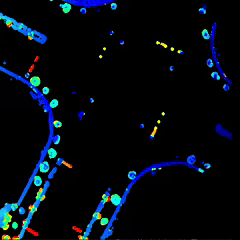
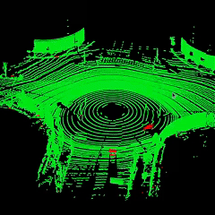
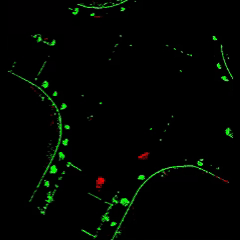

# PGP-DOR
PGP-DOR: A Point-Grid-Point Scheme for Efficient Dynamic Object Removal

## Overview
In autonomous driving, constructing high-precision maps typically represented as 3D point cloud maps and bird's-eye view (BEV) images is essential for both offline and online applications. However, dynamic objects within a scene can introduce artifacts and noise that significantly degrade map accuracy. To address this challenge, we propose a method that accurately identifies and efficiently removes the interference caused by dynamic objects. Our approach fully exploits the spatiotemporal attributes of BEV grids through a point-grid-point (PGP) update strategy while discriminating motion attributes at both the point cloud and BEV grid levels. Moreover, we introduce Bayesian Generative Kernel Inference (BGKI) to perform dense dynamic attribute inference at the grid level, markedly enhancing the accuracy and robustness of moving object detection. Experimental results on public datasets and self-collected data demonstrate that our method consistently outperforms current state-of-the-art approaches in dynamic object removal across both online and offline scenarios at the BEV and point cloud levels.

  
| Traversability Model | Pointcloud Result | BEV Result |
| ------- | ------- | ------- |
|  |  |  |
<!-- | ------- | ------- | ------- | -->

## Repository Status
Currently, the supporting code and dataset are under review as part of the publication process. The materials will be made publicly available upon acceptance of the paper. Please stay tuned for updates.

## Citation
If you find our work helpful, please consider citing our paper (to be updated upon acceptance).

## Contact
For any inquiries, feel free to reach out via GitHub issues or email.
