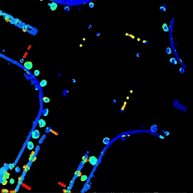
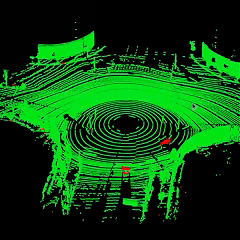
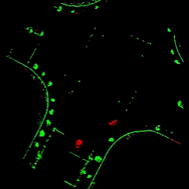

# PGP-DOR

PGP-DOR is an open implementation of the paper **PGP-DOR: A Point-Grid-Point Scheme for Efficient Dynamic Object Removal**. The method removes dynamic objects from LiDAR maps through a point-grid-point update pipeline built on BEV reasoning and Bayesian Generative Kernel Inference.

## Overview

This repository currently provides:

- An offline executable for dataset-style processing: `pgp_dor_kitti`
- A ROS executable for online processing: `pgp_dor_ros_node`
- A cleaned `PGP-DOR-Open` project structure with reduced dependencies
- Shared parameter files under `bin/parameters`

<div align="center">

| Traversability Model | Pointcloud Result | BEV Result |
| ------- | ------- | ------- |
|  |  |  |

</div>

## Qualitative Comparison


## Repository Layout

- `main/pgp_dor_kitti.cpp`: offline entry point
- `main/pgp_dor_ros_node.cpp`: ROS entry point
- `CRemoveDynamic/`: dynamic removal core
- `CTerrainAnalysis/`: terrain modeling and BEV inference
- `misc/`: shared utilities
- `bin/parameters/`: runtime configuration files

## Requirements

The project has been tested on Ubuntu 20.04 with C++17.

Required dependencies:

- `cmake >= 3.16`
- `Eigen3`
- `OpenCV`
- `PCL`

Optional dependencies for ROS mode:

- `ROS Noetic`
- `roscpp`
- `sensor_msgs`
- `nav_msgs`
- `pcl_conversions`

## Installation

### 1. System Packages

For offline mode:

```bash
sudo apt update
sudo apt install -y build-essential cmake libeigen3-dev libopencv-dev libpcl-dev
```

For ROS mode:

```bash
sudo apt install -y ros-noetic-ros-base ros-noetic-pcl-conversions
```

### 2. Build

From the repository root:

```bash
cmake -S PGP-DOR-Open -B PGP-DOR-Open/build
cmake --build PGP-DOR-Open/build -j4
```

After building, the executables are:

- `PGP-DOR-Open/bin/pgp_dor_kitti`
- `PGP-DOR-Open/bin/pgp_dor_ros_node`

## Parameter Files

All runtime parameters are stored in `PGP-DOR-Open/bin/parameters`:

- `pgp_dor_global.ini`: dataset path and frame range for offline mode
- `pgp_dor_remove_dynamic.ini`: core algorithm parameters
- `pgp_dor_ros_topics.ini`: ROS topic names
- `pgp_dor_lidar_specification.ini`: LiDAR intrinsic height configuration

Notes:

- Visualization is controlled by `b_enable_visualization` in `pgp_dor_remove_dynamic.ini`
- `pgp_dor_lidar_specification.ini` is read directly from `bin/parameters`
- ROS mode and offline mode share the same dynamic-removal parameter file

## Offline Usage

Set the dataset path in `PGP-DOR-Open/bin/parameters/pgp_dor_global.ini`:

```ini
m_LoadPath /path/to/your/dataset
start_time 0
end_time 100
```

Then run:

```bash
./PGP-DOR-Open/bin/pgp_dor_kitti
```

Typical outputs are written under:

- `PGP-DOR-Open/bin/outputs/`
- `PGP-DOR-Open/bin/oldmap/`

## ROS Usage

ROS mode consumes:

- `sensor_msgs::PointCloud2`
- `nav_msgs::Odometry`

and publishes labeled `sensor_msgs::PointCloud2`, where:

- intensity `0`: static
- intensity `1`: dynamic

Default topics are configured in `PGP-DOR-Open/bin/parameters/pgp_dor_ros_topics.ini`:

```ini
input_pointcloud_topic /sensor/cloud_registered
input_odometry_topic /self_state/LidarOdometry
output_labeled_pointcloud_topic /pgp_dor_open/labeled_cloud
```

The ROS interface only requires:

- an input point cloud topic
- a synchronized odometry topic

As long as your system provides standard `sensor_msgs::PointCloud2` and `nav_msgs::Odometry`, the ROS executable can be connected directly through `pgp_dor_ros_topics.ini`.

Run the ROS node:

```bash
source /opt/ros/noetic/setup.bash
./PGP-DOR-Open/bin/pgp_dor_ros_node
```

## Quick Try with DynamicMap_Benchmark

For a quick trial, we recommend following the **Quick try** data preparation released by the DynamicMap_Benchmark project:

- Benchmark repository: https://github.com/KTH-RPL/DynamicMap_Benchmark

Their README provides the teaser KITTI sequence download:

```bash
wget https://zenodo.org/records/10886629/files/00.zip
unzip 00.zip -d ${DATA_ROOT}
git clone --recurse-submodules https://github.com/KTH-RPL/DynamicMap_Benchmark.git
```

After the teaser sequence is prepared, set:

```ini
m_LoadPath ${DATA_ROOT}/00
```

in `pgp_dor_global.ini`, and then run:

```bash
./PGP-DOR-Open/bin/pgp_dor_kitti
```

## Benchmark Note

Our inspection and comparison follow the same benchmark direction and quick-try data release from **DynamicMap_Benchmark**. We thank the authors of DynamicMap_Benchmark for releasing the benchmark resources and making dynamic map removal evaluation more reproducible for the community.

## Citation

If you use this repository, please cite our paper:

```bibtex
@article{wang2025pgpdor,
title={PGP-DOR: A Point-Grid-Point Scheme for Efficient Dynamic Object Removal},
author={Shuo Wang and Zhenping Sun and Hanzhang Xue and Bokai Liu and Hao Fu and Yinfu Luo},
journal={IEEE Robotics and Automation Letters},
issue={12},
pages={1-8},
year={2025},
}
```
